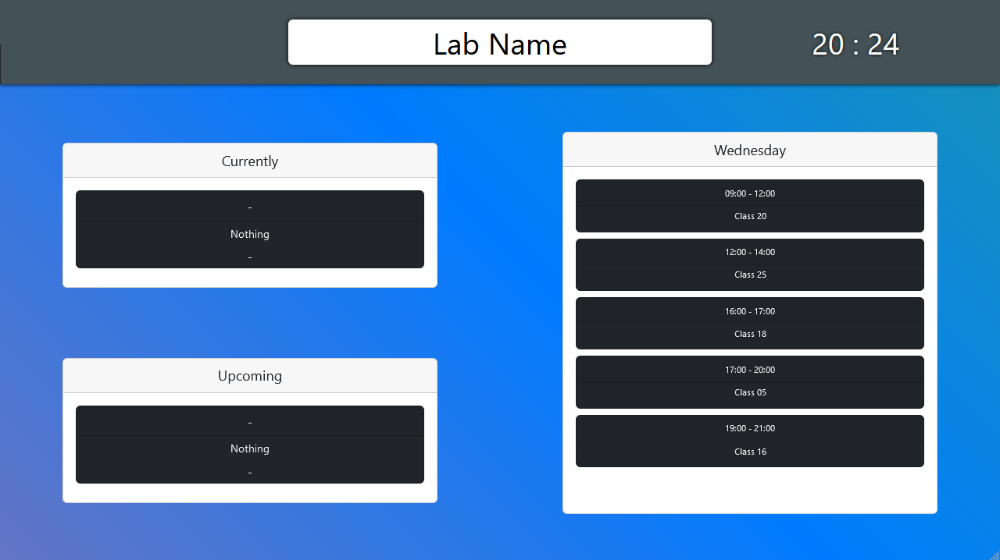
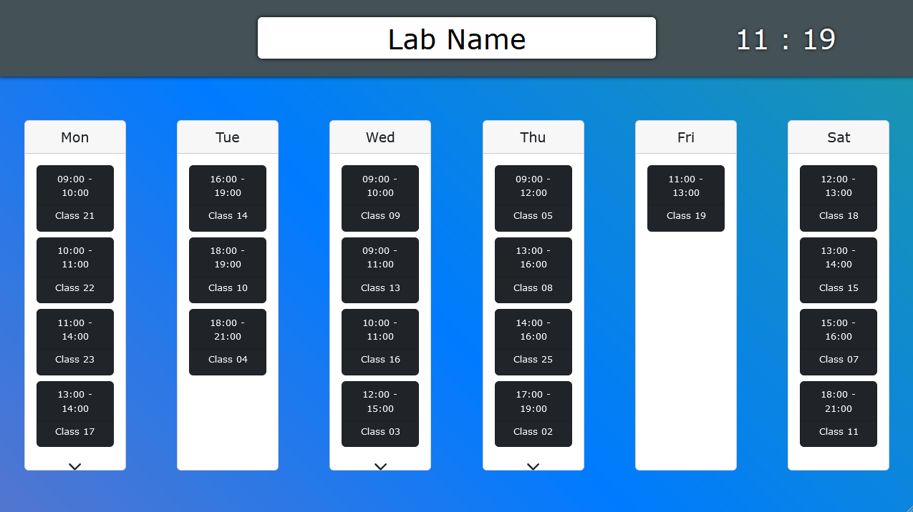

## Lab-Schedule

This web-app showcases a weekly schedule read from an excel file.

It was created to showcase the weekly schedule of ZB109 Consert
lab in UniWA, Greece.

The current repository of the web-app includes the node.js back-end
that serves a react build folder for its front-end.

## Features

This web-app showcases a weekly schedule by swapping between a daily
and a weekly display with a timer of 5-30 seconds.

Daily display:

- current and upcoming classes for the day
- all classes for the day



Weekly display:

- all classes for the whole week



The schedule is read from an excel file of the following format.

> Every cell that has multiple lines writter is considered a class.
>
> The first line is its name and the second is its professor.
>
> The line of the cells represents the time of the class
> (lines 3 to 15 are converted to 09:00 to 21:00 and are assumed
> to take up one hour). If the cell is merged horizontally it will
> add to its total hour length.
> 
> The column of the cells represents the day of the class
> (columnes B to G are converted to Monday throuh Saturday).

Its path should be saved to an .env file based on the provided
[sample](.envsample).

It can be read manually through the settings or it will be read
automatically after every hour that passes.

The file can be included in a Dropbox folder (or any other similar
service) to change the current schedule without manually interacting
with the machine running the app.

Lastly, by clicking on the screen the settings button appears.

| Setting Name | Description |
| --- | --- |
| Lab Name | title on the top side of the app |
| Timer | timer of switching between the daily |
| Daily Max | limit of classes displayed in daily display* |
| Weekly Max | limit of classes displayed in weekly display*  |
| Manual Update | excel file manual read |

*the rest of the classes appear after a small delay


## Prerequisites

Have node.js and npm installed.

The following versions were used when creating the app:

- node.js v18.12.1
- npm 8.19.2

## Installing the app

Follow these steps on a terminal window to install the app:

- clone this repository to your machine

```bash
git clone https://github.com/VaggM/lab-schedule.git
```

- cd to the repository folder

```bash
cd labs-chedule
```

- install npm packages

```bash
npm install
```

## Running the app

To be able to read the schedule from an excel file
a .env file should be created to define the path
to it based on the [sample](.envsample).

To run the app open a terminal on the repository folder
and run:

```bash
node app.js
```

The app opens on port 8000 and can be accessed through
any browser.

## Known Issues

The current version of the app doesn't work well
with low resolution devices and components may
get on top of each other.
