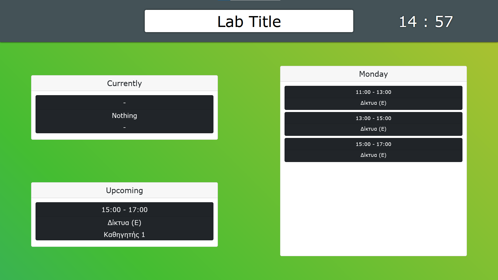
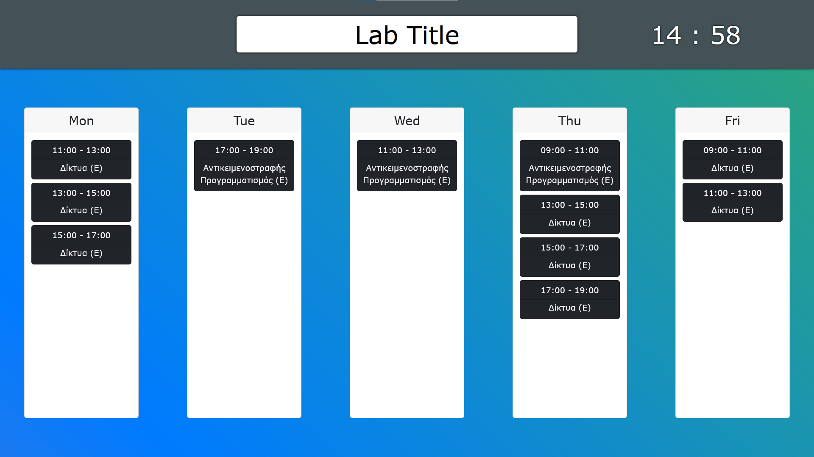
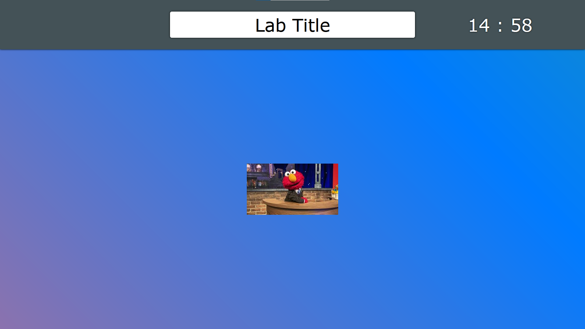

## Lab-Schedule

Lab-Schedule is a web app created to showcase the weekly schedule of ZB109 Consert
lab in UniWA, Greece. The current repository of the web-app includes the node.js back-end
that serves a react build folder for its front-end.

## Prerequisites

Have node.js and npm installed.

The following versions were used when creating the app:

- node.js v18.12.1
- npm 8.19.2


## Installing the app

Follow these steps on a terminal window to install the app:

- clone this repository to your machine

```bash
git clone https://github.com/VaggM/lab-schedule.git
```

- cd to the repository folder

```bash
cd lab-schedule
```

- install npm packages

```bash
npm install
```

## Running the app

Before running the app you need to createa .env file to define the absolute 
data folder path to it based on the [sample](.envsample). The file might 
include an APP_PORT or else port 8000 is used by default.

An example data folder can be found [here](./showcasing/data-example/). 
Data is read every 10 minutes or when someone taps the update button in the 
settings menu. The settings menu appears when someone taps the screen.

To run the app open a terminal on the repository folder and run:

```bash
node app.js
```

The app can now be accessed through any browser on [http://localhost:8080](http://localhost:8080).

## Features

This web-app showcases a weekly schedule by swapping between a daily display,
a weekly display and some loaded images. Swaps happen every few seconds based 
on a timer. App settings and images are set through a data folder on your machine.

Daily display:

- current and upcoming classes for the day
- all classes for the day



Weekly display:

- all classes for the whole week



The schedule is read from an excel file of the following format.
(the excel read happens in the back-end and the classes are provided
through an API, by changing the classes provided in that API url
the front-end will fetch that data instead)

> Every cell that has multiple lines writter is considered a class.
>
> The first line is its name and the second is its professor.
>
> The line of the cells represents the time of the class
> (lines 3 to 15 are converted to 09:00 to 21:00 and are assumed
> to take up one hour). If the cell is merged horizontally it will
> add to its total hour length.
> 
> The column of the cells represents the day of the class
> (columnes B to G are converted to Monday throuh Saturday).

The schedule should be saved in the data folder as "schedule.xlsx.". Check an example file [here](./showcasing/data-example/schedule.xlsx).
The app will try to read it every time the Update button is triggered.

Image display:

- show each image saved in a folder "images" within the data folder



The app will do enough swaps to go through all the images in the data folder.
It accepts .png, .jpg, .jpeg and .gif.

## App Settings

The app can be modified through a settings.json file in the data folder.
An example settings file can be found [here](./showcasing/data-example/settings.json).
Settings are read every 10 minutes or when someone taps the update button 
in the settings menu. The settings menu appears when someone taps the screen.

| Setting Name | Description |
| --- | --- |
| labname | title on the top side of the app |
| dailysplit | split limit for showcases classes on daily display |
| weeklysplit | split limit for showcases classes on weekly display |
| time | swap timer between displays |

## Known Issues

The current version of the app doesn't work well
with low resolution devices and components may
get on top of each other.
